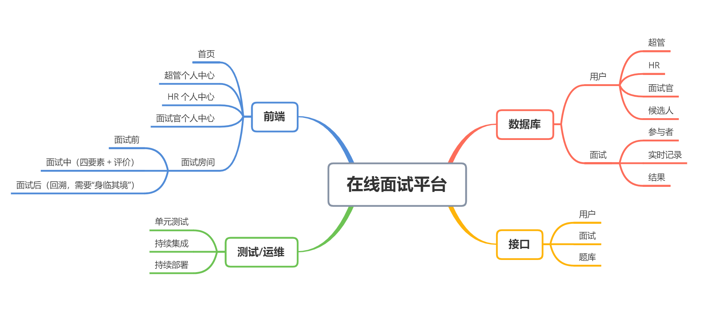

# 需求分析文档

[TOC]

## 1. 简介

## 1.1 目的

本文档为在线面试平台的软件需求文档。该需求文档主要包含了在线面试平台的各种需求分析以及功能介绍。该文档的主要读者为甲方（XXX 真实客户），用于明确该产品的各种需求供甲方参考，以便于后期软件系统的实际开发过程。

## 1.2 范围

本文档包含了关于产品在线面试平台的需求分析。

具体包含了关于产品的具体需求分析、总体设计约束、软件质量特性、需求分级等方面信息。这些需求分析需要甲方在正式工作前确认。

## 2. 需求分析

### 2.1 用户视角

#### 2.1.1 超管

超管有账号、可登录。数量只有 1 个，在数据库初始化的时候设置其用户名、密码。

超管可添加 HR、面试官、候选人（前两者可以手动导入，最后一个可以从 CSV 文件、Excel 文件导入）。

超管可给 HR 分配需要筛选的候选人，一个候选人只能分给一个 HR；也给 HR 分配其可用的面试官，一个面试官可分给多个 HR。

#### 2.1.2 HR

HR 有账号有账号、可登录。

HR 手里有需要筛选的候选人，有可以分配的面试官（这二者都是由超管分配的），HR 需要利用手里的面试官筛选候选人。

HR 筛选候选人的过程如下：先将手里的候选人分配给面试官同时指定面试时长（面试时长默认值为 30 分钟；分配时要保证面试官的已有面试任务不重叠且至少间隔 10 分钟），从面试官那里获得评价，根据面试官的评价（等级（SABCD），评语）做出自己的评价（录用、拒绝、进入下一轮）。

HR 可旁观面试，但不能干预。

HR 可回溯面试过程，回溯时可以看到面试过程的文字聊天、白板、代码、视频。

#### 2.1.3 面试官

面试官有账号、可登录。

面试官在系统里面填入自己的空闲时间，服从 HR 的安排（面试谁、什么时候面都由 HR 说的算）。

面试官参加面试时，有一个常驻的评价框，面试官可在其中写评价（等级（SABCD），评语）。

面试中，面试官窗口显示”结束面试“、”提交评价“、”提交评价并结束面试“三个按钮：

- 当面试被系统强制结束（超时 10 分钟或这个面试官距离其下个面试不足 10 分钟），若这个时刻面试官在线，面试官可继续编辑评价，编辑完之后点击”提交评价“，若这个时刻面试官不在线（面试官一直迟到到现在或面试官面试了一段时间，但是没有结束面试就提前离去），那么自动提交评价框的评价；
- 当面试不是被强制结束（双方约定好提前结束或候选人迟到且面试官不想再等），若面试官的评价已经写好，可以直接点击”提交评价并结束面试“，若还没写完，可以先点击“结束面试”，此时可以继续编辑评价，编辑完之后点击“提交评价”。

#### 2.1.4 候选人

候选人无账号，用二元组 `(邮箱, 姓名)` 表示。

候选人由超管导入系统，被超管指定一个 HR，被 HR 分配面试官来面试，候选人通过邮件收到面试通知，里面有面试详情、进入面试房间的链接（链接有安全措施，比如 `domain.com/room/10086?token=USTC`）。

### 2.2 功能视角

本软件是一个在线面试平台，用于帮助企业完成在线筛选候选人工作，主要包括下列功能。

#### 2.2.1 预约面试

HR 将手里的候选人分配给面试官同时指定面试时长（面试时长默认值为 30 分钟；分配时要保证面试官的已有面试任务不重叠且至少间隔 10 分钟），然后此次面试会出现在 HR 的“面试管理”页面的“未开始的面试”列表，还有面试官的“面试管理”页面的“未开始的面试”列表。此次面试的一个房间链接会被生成，并被发送给候选人（候选人通过邮件收到面试通知，里面有面试详情和进入面试房间的链接）。

目前暂定候选人和面试官都无法表达意向时间，完全由 HR 确定面试安排（或者候选人的元组 `(邮箱, 姓名)` 变成 `(邮箱, 姓名, 意向时间)`，HR 可以适当考虑下候选人的意向时间）。

#### 2.2.2 面试

面试官从自己的”需面试列表”加入面试，候选人从邮箱里收到的链接进入面试。HR 可从自己的“面试管理”页面的“进行中的面试”列表或“未开始的面试”列表加入旁观（面试官和候选人不知道 HR 在不在旁观）。

每次面试之间相互独立。

每场面试都需要有评价，评价包括等级（ABCDE）和评语。

面试时用于交流的方式有文字聊天、白板、视频聊天和代码编辑。其中白板和代码编辑框由面试双方共享。代码编辑部分，由系统提供题库，面试官从中任选题。

面试的默认时长是 30 分钟。若超时，则显式提醒超时；若超时 10 分钟则强制结束。若距离这个面试官的下一场面试不足 10 分钟，也强制结束。

当面试被系统强制结束（超时 10 分钟或这个面试官距离 TA 的下个面试不足 10 分钟），若这个时刻面试官不在线（面试官一直迟到到现在或面试官面试了一段时间，但是没有结束面试就提前离去），那么自动提交评价框的评价。

#### 2.2.3 面试回溯

HR 可以回溯面试，回溯的范围是自己安排的已结束的面试。进入方式是从自己的“面试管理”页面的“已结束的面试”列表进入。

#### 2.2.4 通知系统

通知系统由邮件通知和网页内通知消息组成。

HR 安排完一场面试之后，系统自动给参与面试的面试官和候选人发送邮件；HR 根据面试官提交的评分确定完一场面试的最终结果（通过、拒绝或继续下一场）之后，系统也会给候选人发送邮件通知。

网页内通知消息用于服务可登陆用户（除了候选人其他都是可登录用户），用于提醒和当前用户相关的消息。

## 3. 总体设计约束

### 3.1 标准符合性

采用国际标准。

### 3.2 硬件约束

在线面试平台将运行在数据库服务器和 WEB 服务器之上，其硬件约束如下所示。

**数据库服务器**

| 项目         | 建议规格                                                                                          | 最低规格                                                                                          |
| ------------ | ------------------------------------------------------------------------------------------------- | ------------------------------------------------------------------------------------------------- |
| 设备类型     | 机架式服务器                                                                                      | 机架式服务器                                                                                      |
| 结构         | 4U                                                                                                | 4U                                                                                                |
| CPU 类型     | 四核 AMD Opteron8387                                                                              | 八核 AMD Operon6128                                                                               |
| CPU 频率     | 2800MHz                                                                                           | 2000MHz                                                                                           |
| 处理器描述   | 标配处理器数 4 个                                                                                 | 标配处理器数 4 个                                                                                 |
| 处理器缓存   | 每核心 512KB 集成二级高速缓存,16MB 共享三级高速缓存                                               | 每核心 512KB 集成二级高速缓存,16MB 共享三级高速缓存                                               |
| 内存类型     | DDR4 1600Mhz ECC                                                                                  | DDR3 1333Mhz                                                                                      |
| 内存大小     | 16 GB                                                                                             | 16 GB                                                                                             |
| 最大内存容量 | 256GB                                                                                             | 256 GB                                                                                            |
| 硬盘         | NVME 512GB 固态硬盘                                                                               | SATA3 7200r 512GB 机械硬盘                                                                        |
| 网络适配器   | 带有 TCP/IP 卸载引擎的两个嵌入式 NC371i 多功能千兆网络适配器,通过一个可选许可套件支持加速的 iSCSI | 带有 TCP/IP 卸载引擎的两个嵌入式 NC371i 多功能千兆网络适配器,通过一个可选许可套件支持加速的 iSCSI |
| 冗余电源数量 | 2                                                                                                 | 1                                                                                                 |
| 功率         | 910W/1300W                                                                                        | 910W/1300W                                                                                        |
| 参考机型     | HP ProLiant DL585 G5(500922-AA1)                                                                  | HP ProLiant DL585 G5(500922-AA1)                                                                  |

**WEB 服务器**

| 项目         | 推荐配置                                 | 最低配置                                 |
| ------------ | ---------------------------------------- | ---------------------------------------- |
| 设备类型     | 机架式服务器                             | 机架式服务器                             |
| 结构         | 2U                                       | 2U                                       |
| CPU 类型     | 六 核 AMD Opteron 4180 CPU               | 六 核 AMD Opteron 4180 CPU               |
| CPU 频率     | 2600MHz                                  | 2600MHz                                  |
| 处理器描述   | 标配处理器数 2 个                        | 标配处理器数 1 个                        |
| 处理器缓存   | 9MB 三级缓存                             | 9MB 三级缓存                             |
| 内存类型     | DDR4 1600Mhz ECC                         | DDR3 1333Mhz                             |
| 内存大小     | 16GB                                     | 12GB                                     |
| 最大内存容量 | 128GB                                    | 128GB                                    |
| 硬盘大小     | NVME 512GB 固态硬盘                      | SATA3 7200r 512GB 机械硬盘               |
| 网络适配器   | 2 个 NC382i 双端口多功能千兆服务器适配器 | 2 个 NC382i 双端口多功能千兆服务器适配器 |
| 冗余电源数量 | 2                                        | 1                                        |
| 冗余电源数量 | 750W                                     | 460W                                     |
| 参考机型     | HP ProLiant G6(570102-AA1) 4.3 DL385     | HP ProLiant G6(570102-AA1) 4.3 DL385     |

### 3.3 技术限制

主要采用 JavaScript 进行前段开发、Python 进行后端开发，采用关系型数据库。接口应符合国家颁布的各种标准。源码中应包含详细的注释，以便于后续更改及维护。

## 4. 软件质量特性

### 4.1 便利性

在线面试平台作为企业招聘、面试的服务平台，应满足便利性需求。具体的便利性需求在以下列出：

1. 功能命名准确，避免误导。
2. 用户能快速找到所需功能。
3. 用户操作简单。该条性能通过降低功能索引层级,以及减少冗杂操作实现。

### 4.2 高效性

在线面试平台作为企业招聘、面试的服务平台，应满足高效性需求。具体的高效性需求在以下列出：

1. 对于用户操作，能在短时间内进行正确反馈。服务器做出反应的时间应不超过 0.1 s。
2. 能同时处理多个用户的操作申请，且不会导致反应时间降低。
3. 例行正常自检与维护耗时短，不会影响用户使用体验。

### 4.3 健壮性

在线面试平台作为企业招聘、面试的服务平台，应满足健壮性需求。具体的健壮性需求在以下列出：

1. 不会因异常数据，导致不可挽回的后果。该条性能通过,建立完善的异常处理机制实现。

### 4.4 安全性

在线面试平台作为企业招聘、面试的服务平台，应满足安全性需求。具体的安全性需求在以下列出：

1. 防止数据劫持，防止外部入侵,防止跨权限修改。

### 4.5 抗压性

在线面试平台作为企业招聘、面试的服务平台，应满足抗压性需求。具体的抗压性需求在以下列出：

1. 具有应对大量数据流入的能力。
2. 能够满足多用户操作申请，并予以正确反馈。

### 4.6 数据容灾性

在线面试平台作为企业招聘、面试的服务平台，应满足数据容灾性需求。具体的数据容灾性需求在以下列出：

1. 具有应对硬件损坏的能力。该条性能可通过异地备份实现。
2. 具有恢复之前版本的能力。该条性能可通过按时段备份实现。

## 5. 需求分级

本节对在线面试平台的需求进行分级，以辅助产品设计。

需求重要性分类如下:

1. 基本需求：必须的绝对基本的特性。

2. 附加需求：可选的特性，但这些特性会影响产品的生存能力。

### 5.1 基本需求

- 面试时的文字聊天
- 面试时的视频聊天
- 面试时的共享白板
- 面试时的共享代码编辑
- 面试时的评价系统
- 回溯面试
- 邮件通知系统
- 用户登录功能
- 用户更改密码
- 显示用户资料
- 管理员管理 HR
- 管理员管理候选人
- 管理员管理面试官
- HR 查看和管理正在进行的面试
- HR 查看和管理已结束的面试
- HR 查看和管理未开始的面试
- HR 查看和管理分配到的候选人
- HR 查看和管理分配到的面试官
- 面试官显示和更改个人空闲时间
- 面试官查看和管理正在进行的面试
- 面试官查看和管理未开始的面试

### 5.2 附加需求

- 面试时的代码可运行、可反馈结果
- 站内通知消息（区别于邮件通知）
- 显示管理员的 Dashboard
- 管理员管理 OJ 题目
- 显示 HR 的 Dashboard
- 显示面试官的 Dashboard

## 附录 A：脑图

